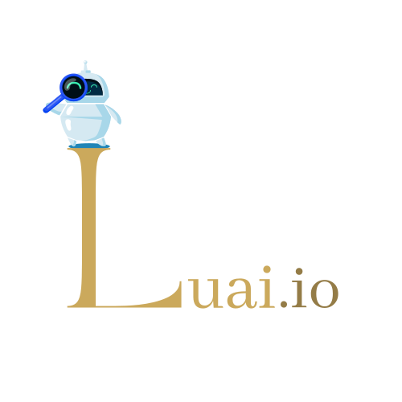
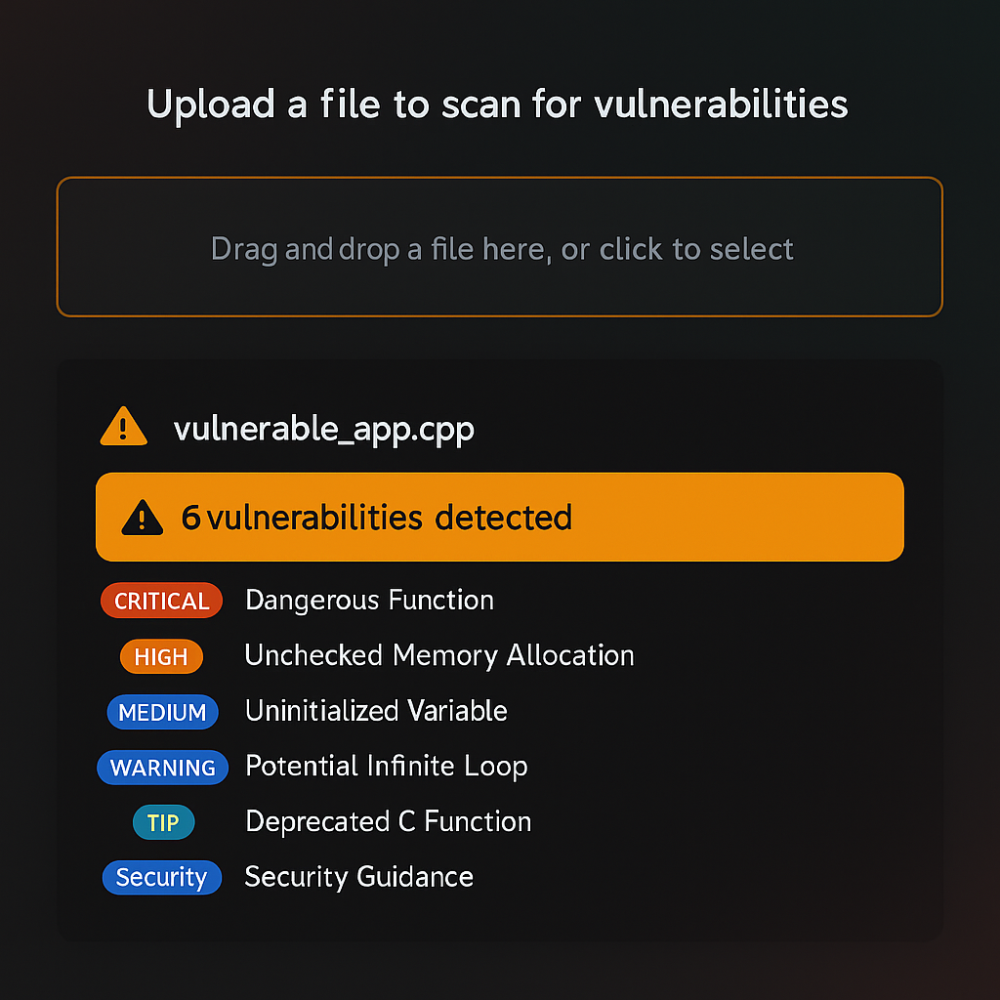

<div align="center">


# Luai – AI-Powered Secure Code Scanner

**Modern. Secure. AI-Aware.**

[](https://github.com/tinkerlev/nuvai/actions)
[](https://owasp.org)
[](https://flask.palletsprojects.com/)
[](https://reactjs.org/)

</div>

> **Luai** is a secure-by-design, static analysis engine crafted for developers, red-teamers, and AI-era coders
>
> Built with the rigor of real-world offensive security testing and designed for high-stakes environments

---

📌 What Does Luai Scan?

Luai performs static code analysis (SAST) — it inspects code without executing it to identify potential security issues, bad patterns, and weak practices.

🔍 What It Scans:

.py, .js, .jsx, .ts, .html, .php, .cpp and more

Code uploaded via drag-and-drop or API

🧠 How It Works:

1. Detects the programming language by extension and content

2. Loads the appropriate secure scanner module (e.g., jsx_scanner.py)

3. Parses the content line-by-line using regex and static rules

4. Flags patterns like:

    *   eval() / exec() / innerHTML

    *   Hardcoded secrets, unsafe storage, insecure API calls

    *   AI-generated risky constructs (e.g., Copilot patterns)

5. Outputs detailed report (JSON/UI) — never executes the code

🔐 Security Principles:

*   Code is treated as plain text only

*   **No use of eval(), exec(), or **subprocess() in the engine

*   Uploaded files are scanned and immediately deleted

*   Sensitive keywords (token, secret, password) are redacted in logs

*   Code audit checker: check_no_execution.py verifies backend safety

----

## 📌 Overview

**Luai** scans uploaded source code (Python, JS, JSX, etc.) for security flaws and code hygiene issues — without ever executing it. It’s fast, extensible, and fully aligned with strict standards like ISO 27001, NIST SSDF, and OWASP.

```bash
✔ Zero code execution
✔ AI-generated code awareness
✔ Dev-ready reporting and integrations
```

---

## ✨ Highlights

| Feature                   | Description                                             |
| ------------------------- | ------------------------------------------------------- |
| 🔐 Zero Execution         | Code is parsed, analyzed — never run                    |
| 🧠 AI-Aware Engine        | Recognizes patterns from GPT/Copilot/StackOverflow      |
| 📚 Multi-Language Support | Python, JavaScript, HTML, JSX, PHP, TypeScript, C++     |
| 📄 Smart Reports          | Output in JSON, TXT, HTML, PDF                          |
| 🧪 Audit Tool             | `check_no_execution.py` ensures your backend is clean   |
| 📦 Modular Scanner Design | Add rules per language easily                           |
| 🌐 Modern UI              | React + Tailwind interface for file uploads and results |
| 🛡 Compliance Ready       | ISO/IEC 27001, OWASP Top 10, NIST SSDF aligned          |

---

## 🧭 Use Cases

* ✅ Audit AI-generated code before deploying
* ✅ Prevent interns/devs from uploading insecure code to production
* ✅ Shift-left secure coding in CI/CD pipelines
* ✅ Run security workshops and demos with real-time scanning

---

## 🧪 Live Demo & Playground

Try Luai now at: [https://luai.io](https://luai.io) *(coming soon)*

Use our sandbox to:

* Drag-and-drop code files and inspect findings
* Run simulated scans using real vulnerable examples
* Export your report instantly in preferred format

🎬 **Example scan animation:**


📸 **Smart Screenshots:**

<table>
  <tr>
    <td></td>
    <td></td>
  </tr>
  <tr>
    <td align="center">File Upload View</td>
    <td align="center">Vulnerability Report</td>
  </tr>
</table>

---

## 🚀 Quickstart

```bash
# Backend
cd backend
python3 -m venv .venv && source .venv/bin/activate
pip install -r requirements.txt
python server.py

# Frontend
cd frontend
npm install && npm run dev
```

📂 Environment: `.env`

```env
API_PORT=5000
ALLOWED_ORIGINS=http://localhost:3000
MAX_UPLOAD_SIZE_MB=2
```

---

## 🧪 API – POST /scan

Send one or more code files to the `/scan` endpoint:

```bash
curl -F "files=@example.js" http://localhost:5000/scan
```

Returns a structured report with:

* File name
* Language detected
* Vulnerability list (severity, title, description, recommendation)

---

## 📁 Project Structure

```txt
📦 Nuvai
├── backend/              # Flask API
│   ├── server.py
│   └── src/nuvai/        # Core engine & scanners
│       ├── scanner.py
│       ├── utils/
│       ├── jsx_scanner.py, etc.
├── frontend/             # React + Tailwind UI
│   └── src/pages/
├── security/
│   └── check_no_execution.py
├── examples/             # Sample files to test scanning
```

---

## 🧩 Integrations (Coming Soon)

| Integration            | Purpose                                    |
| ---------------------- | ------------------------------------------ |
| ✅ GitHub SARIF Export  | Appear in GitHub Security tab              |
| 🧪 Git Pre-Commit Hook | Block commits with high-severity issues    |
| 🔐 OAuth2 Auth         | Add secure auth for scan permissions       |
| 🧱 CI Plugins          | GitHub Actions, GitLab CI, Jenkins         |
| 🧵 Slack Alerts        | Team alerts on new issues                  |
| 📦 Plugin SDK          | Add custom scanning logic for any language |
| ⚙️ Docker Image        | Secure container deployment                |
| 🖥 VSCode Extension    | Run scans in editor                        |

---

## 🛡️ Security Philosophy

* No `eval()`, `exec()`, `subprocess()` anywhere in the scanner
* Files scanned as plain text (UTF-8 enforced)
* Logs redact `token`, `secret`, `password`, `apikey`
* Temp files auto-deleted post-scan
* Includes audit tool: `check_no_execution.py`

---

## ✅ Standards & Compliance

| Framework     | Status       |
| ------------- | ------------ |
| ISO/IEC 27001 | ✅ Aligned    |
| OWASP Top 10  | ✅ Mapped     |
| NIST SSDF     | ✅ Structured |

---

## 👤 About the Author

**Eliran Loai Deeb**
Cybersecurity architect | AI security researcher | Pentesting instructor

🔗 [https://luai.io](https://luai.io)
📫 [info@luai.io](mailto:info@luai.io)

---

## 📄 License

Private project – not open-source. Contact the author to discuss commercial or research collaborations.

> Built with ❤️ to make code safer in the AI era.
